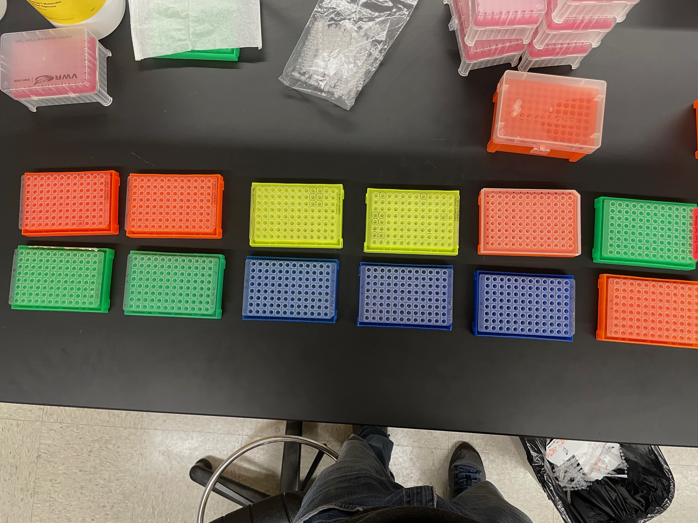

## Organization and Workflow for GBS for Tepe Solanum and Valentina's house wren samples 
Organizational notes and code for two sequencing sets:
- 4 *Castanea dentata* (CADE, American chestnut) plates from Jill Hamilton
- 1 plate of *Fraxinus velutina* (FRVE below), collected by Trevor Faske, extracted at AG BIO.
- ~50 samples of brook trout from Jason Kenagy at PSU
- see photos of sample organization for HOWR

 

## Sample organization
- Full information on DNAs for each individual sampled across natural distribution can be found in `GitHub/RFseq_projects/chestnut_velutina_brooktrout_PSU/`. This file also has the updated plate maps with specified IDs.

- barcode key file corresponds with CADE_FRVELib:

## Notes on library preparation

### R/L and PCR for plates 1-4. 

- Master mix in `CADE_FRVE_RFseq_mastermixcockatils.xlsx`.
- Restriction done on 12/13/23
- Ligation complete on 12/15/23

6/29/23: gel for TEPE23_LIB1
 

10 ul of each PCR product into final library. Tubes in door of freezer labelled **TEPE23_LIB**.

## Data analysis: contaminant cleaning, barcode parsing, data storage, directory organization, and initial analyses.

We generated one lane of S1 chemistry NovaSeq data at UTGSAF in August of 2023. 

## This file contains code and notes for
1) cleaning contaminants using tapioca
2) parsing barcodes
3) splitting fastqs 
4) de novo assembly
5) reference based assembly
6) calling variants
7) filtering
8) entropy for genotype probabilities.

## 1. Cleaning contaminants

Being executed on ponderosa using tapioca pipeline. Commands in two bash scripts (cleaning_bash_TEPE23.sh), executed as below (9/11/23).

Decompress fastq file:

    $ gunzip TEPE23_S133_L002_R1_001.fastq.gz

Number of reads **before** cleaning:

    $ nohup grep -c "^@" TEPE23_S133_L002_R1_001.fastq > TEPE23_number_of_rawreads.txt &
    ## raw reads: 1,020,080,241

To run cleaning_bash* tapioca wrapper, exit conda environment, load modules, and run bash scripts.

    $ module load fqutils/0.4.1
    $ module load bowtie2/2.2.5
    
    $ bash cleaning_bash_TEPE23.sh &

After .clean.fastq has been produced, rm raw data:

    $ rm -rf TEPE23_S133_L002_R1_001.fastq &

Raw data will stay stored in: /archive/parchman_lab/rawdata_to_backup/FRLA/

Number of reads **after** cleaning:

    $ nohup grep -c "^@" TEPE23.clean.fastq > TEPE23_clean_reads.txt &
    # number of clean reads : 627,879,872

####################################################################################
## 2. Barcode parsing:
####################################################################################

Be sure to deactivate conda environment before running the below steps. Barcode keyfiles are `/working/parchman/TEPE23/FRLA1_barcode_key.csv`
`
Parsing FRLA1 library:

    $ nohup perl parse_barcodes768.pl TEPE23_barcodekey.csv TEPE23.clean.fastq A00 &>/dev/null &

# DONE TO HERE
`NOTE`: the A00 object is the code that identifies the sequencer (first three characters after the @ in the fastq identifier).

    $ less parsereport_TEPE23.clean.fastq

    Good mids count: 586412516
    Bad mids count: 41467189
    Number of seqs with potential MSE adapter in seq: 275328
    Seqs that were too short after removing MSE and beyond: 167

####################################################################################
## 3. splitting fastqs
####################################################################################

For FRLA, doing this in `/working/parchman/TEPE23/splitfastqs_TEPE23/*`

Make ids file

    $ cut -f 3 -d "," TEPE23_barcodekey.csv | grep "_" > TEPE23_ids_noheader.txt

Split fastqs by individual

    $ nohup perl splitFastq_universal_regex.pl TEPE23_ids_noheader.txt parsed_TEPE23.clean.fastq &>/dev/null &

# DONE TO HERE &&&&&&&&&&

Zip the parsed*fastq files for now, but delete once patterns and qc are verified.

### Moving fastqs to project specific directories

Fastqs by species are located on ponderosa in:

FRLA1:
`/working/parchman/FRLA`

FRLA2:
`/working/parchman/FRLA`

